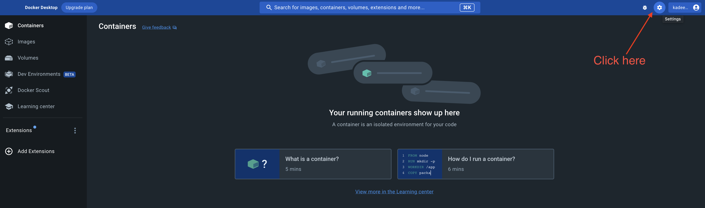
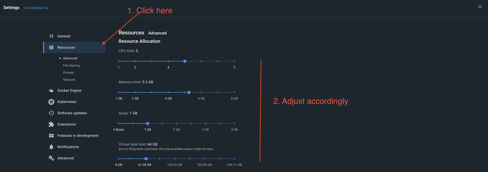
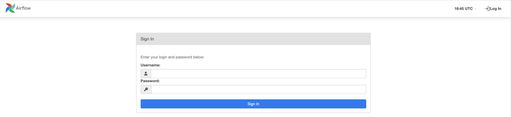
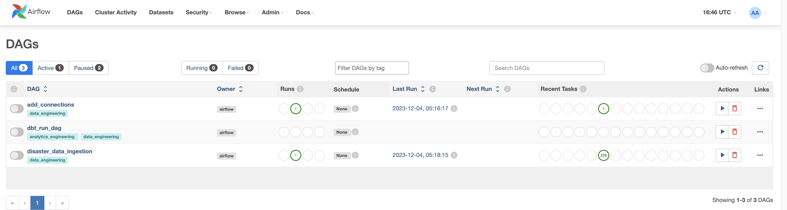
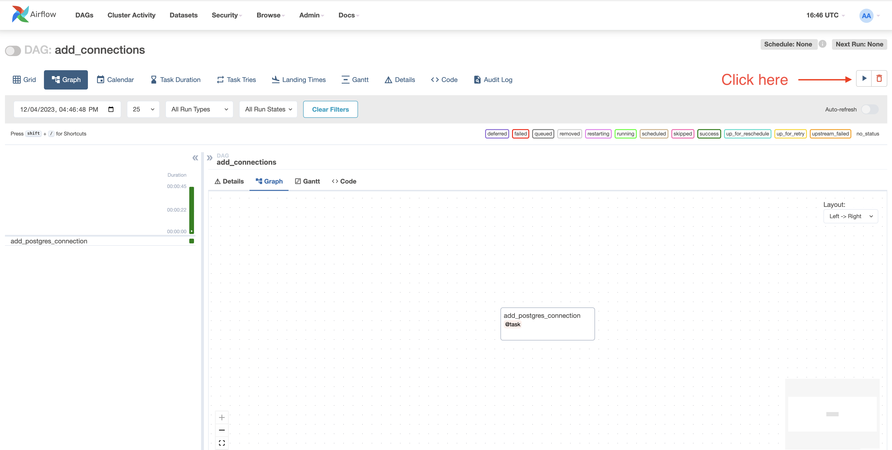
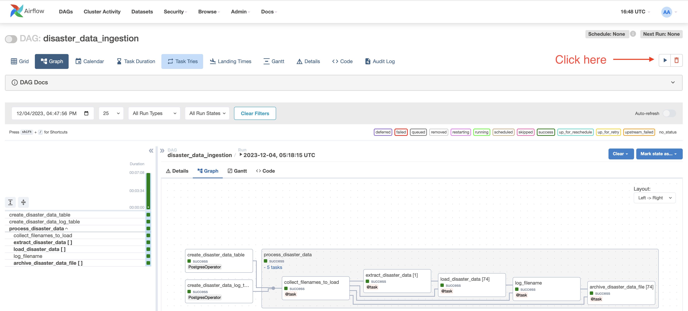
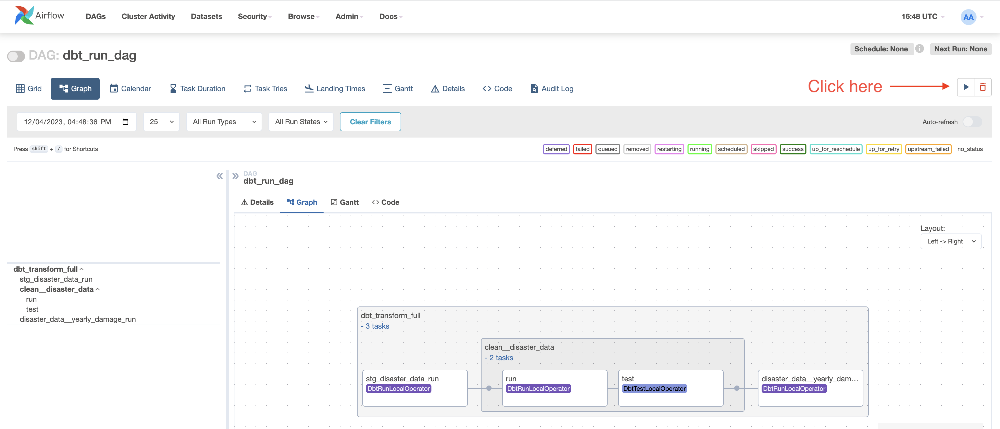

# Disaster data

The disaster data repo is a sample integration that I worked on that downloads data from the [NCDC website](https://www1.ncdc.noaa.gov/pub/data/swdi/stormevents/csvfiles/), loads it a postgres database and cleans it for querying.

#### Tools Used

- Python
- Pandas
- Docker
- Airflow
- Postgres
- Astronomer

## Running the project

### Prerequisites

Before you can start running the integration you'll need to download [Docker Desktop](https://www.docker.com/products/docker-desktop/), [Astronmer](https://docs.astronomer.io/astro/cli/install-cli) as well as [Git](https://git-scm.com/downloads) to your local computer. The free community version is enough to get this project running. In order to run this project you'll need at least **4GB** of RAM to allocate to the services that docker will create.

**Please note** If this is your first time downloading docker, be sure to set how much memory/CPU cores docker is allocated.

1. Go to settings
    

2. Change resource allocation. Remember, this app will need at least 4GB of memory.
    

### Starting the app

Now that we have all the prerequisites out of the way, let's bring up the app!

1. Clone the repo

   Open up the command line/terminal and clone the repository to your local machine in a folder of your choosing.

    ```shell
    git clone git@github.com:codekid/disaster_data.git
    ```

2. Launch the services

    Once you have the repository downloaded, navigate to the folder in the terminal and run the following command. Running this command will start all the containers and import all prequisites necessary for the app.

    ```shell
    astro dev start
    ```

    After a few minutes all services should be up and running. Once they're up you'll be able to navigate to your [local airflow webserver](http://localhost:8080/). The default user is `admin` and password is `admin`.
    

    Once you've successfully logged into the webserver you should see three DAGs; `add_connections_dag`, `disaster_data_ingestion_dag` and `dbt_run_dag`.
    

    - `add_connections_dag` creates the connection to your local postgres server.
    - `disaster_data_ingestion_dag` extracts and loads the data.
    - `dbt_run_dag` cleans the data and creates a summary.

3. Run each DAG

    The DAGs must be run in the following order:
    You'll need to click on each DAG and click the "run" button.
    1. `add_connections_dag`
        
        Once this DAG is complete, go Admin -> Connections. Click the edit record icon for `tutorial_pg_conn`. Add `airflow` in the `Database` section and remove `{}` in the `Extra` section. Ssave the changes.

    2. `disaster_data_ingestion_dag`
        
        After this DAG completes there will be two new tables in postgres;
    3. `dbt_run_dag`
        

4. Data Ingested!
    Congrats! You've successfully ingest the disaster data! :clap:

## Querying the data

To query the that was ingested and cleaned you'll need to use a tool to connect to the Postgres database. [PgAdmin](https://www.pgadmin.org/download/) is a free tool (But you're welcomed to use whatever tool that you have access to).

In the object explorer of PgAdmin, right click on Servers -> Register -> Server..

Connection Details
-

- Connection Name: `airflow-postgres`
- Host name/address: `localhost`
- Username: `postgres`
- Password: `postgres`
- Port: `5432`

Query the data
-

The following tables should be available for you to query.

- postgres.public.disaster_data
- postgres.public.disaster_data_log
- postgres.postgres_airflow.stg_disaster_data
- postgres.postgres_clean.clean__disaster_data
- postgres.postgres_disaster_data.disaster_data__yearly_damage

Turning off the services
-

If you'd like to wind down all of the services, simply enter the command below in the main project folder

```shell
astro dev stop
```
